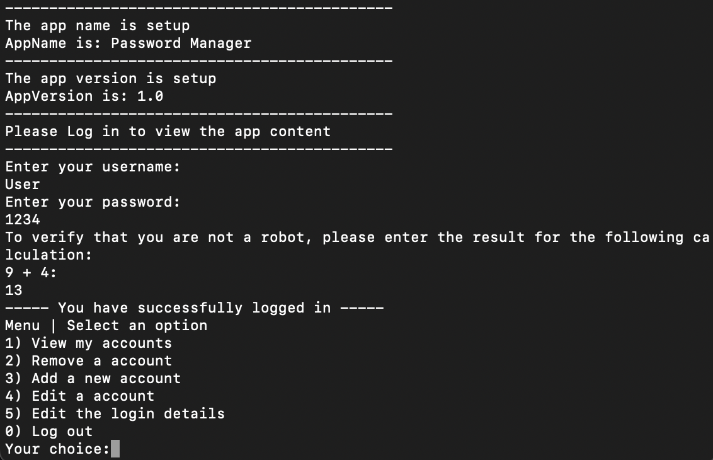

# PasswordManager

## Description
Password Manager is a simple password management application that allows users to store and manage passwords for different accounts.

## Features

1) View my accounts
2) Remove a account
3) Add a new account
4) Edit a account
5) Edit the login details
0) Log out

## Instructions for Use
To compile and run the project, follow the steps below:

1. Open the terminal and navigate to the project directory.
2. Compile the project using the command: `javac Main.java`.
3. Run the application with the command: `java Main`.

